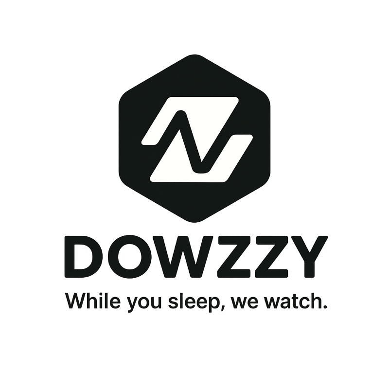

  

# Dowzzy — Website Monitoring SaaS

**Dowzzy** is a modern SaaS platform designed to monitor website availability and notify users instantly in case of downtime. Whether you're a developer, DevOps team, or business owner, Dowzzy helps you stay informed and in control — even while you sleep.

## 🚀 Key Features
- Uptime checks based on user subscription tier
- Instant alerts via **Email, SMS, and WhatsApp**
- Minimalist and intuitive interface
- Scalable for individuals, teams, and organizations

> **“While you sleep, we watch.”**

🔗 Visit us soon: [dowzzy.com](https://dowzzy.com) *(placeholder)*

---

## 📄 License

This project is **proprietary software**.  
All rights are reserved by the Dowzzy team.  
**Any unauthorized use, copying, distribution or modification is strictly prohibited.**
